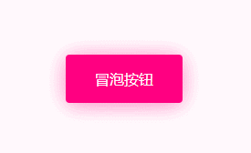

# 冒泡按钮

使用例子

```jsx
import React from "react";
import ReactDOM from "react-dom";
import { Table } from '../dist/main.js'

ReactDOM.render(
  <div style={{ width: 300,marginBottom:20 }}>
    <Buttons.Bubbly>冒泡按钮</Buttons.Bubbly>
  </div>,
  document.getElementById("root")
);
```



## 类型定义

null

## props

* styles?: React.CSSProperties;         // ? 按钮额外样式
* primaryColor?: string;                // ? 按钮主题色
