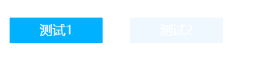

# 简单的切换 单切

使用例子

```jsx
import React from "react";
import ReactDOM from "react-dom";
import { Table } from '../dist/main.js'

ReactDOM.render(
  <div style={{ width: 300 }}>
    <Tab tabArrs={['测试1','测试2']} callback={(e:any) => console.log(e)} style={{background:'#fff'}}/>
  </div>,
  document.getElementById("root")
);
```



## 类型定义

src/Tab/index.d.ts

## props

* tabArrs: Array<string>;           // ? 字符串数组，代表切换的内容
* callback: Function;               // ? 单切时回调数组下标
* style?: CSSProperties;            // ? 整体样式
* itemStyle?: CSSProperties;        // ? 每个tab的样式
