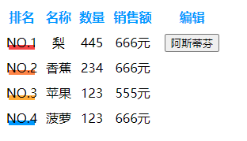

# 不会分页的table

## 目的

常用的滚动表格，数据量不多，有排序，滚动，自定义样式，互动的基本需求。

## 使用例子

```jsx
import React from "react";
import ReactDOM from "react-dom";
import { Table } from '../dist/main.js'

ReactDOM.render(
  <div style={{width:300}}>
    <Table
      source={[
        { name: "苹果", count: 123,sale:555 },
        { name: "香蕉", count: 234,sale:666 },
        { name: "菠萝", count: 123,sale:666 },
        { name: "梨", count: 445 ,sale:666,edit:'阿斯蒂芬'},
      ]}
      cols={[
        { dataIndex: "name", title: "名称" ,width:'80px'},
        { dataIndex: "count", title: "数量" ,width:'80px'},
        { dataIndex: "sale", title:"销售额",unit:'元',width:'80px' },
        {  dataIndex: "edit",title:'编辑',,width:'80px',render:(content:any) => {
        return <button>{content}</button>
        } }
      ]}
      rank={'count'}
      scroll={`
        &::-webkit-scrollbar {
          width : 15px;
          height: 5px;
        }
        &::-webkit-scrollbar-thumb {
          border-radius: 10px;
          box-shadow   : inset 0 0 5px rgba(0, 0, 0, 0.2);
          background   : #0088FF;
        }
        &::-webkit-scrollbar-track {
          box-shadow   : inset 0 0 5px rgba(0, 0, 0, 0.2);
          border-radius: 10px;
        }
      `}
    />
  </div>,
  document.getElementById("root")
);
```



## 类型定义

src/Table/index.d.ts

## props

* source: Source[];                 // ? 输入的数据
* rank?: string;                    // ? 是否对某个字段排序
* cols: TableCols[];                // ? 输入数据的枚举
* order?: Order;                    // ? 升序或者降序
* max?: number;                     // ? 数据显示最大长度，多余的会被滚动条隐藏
* type?: 'noNO';                    // ? 是否添加排名序号
* LineHeight?: number;              // ? 行高
* divider?: boolean;                // ? 是否添加分割线
* styles?: React.CSSProperties;     // ? 覆盖表格样式
* scroll?: string                   // ? css 字符串 用于自定义scroll样式 详情看例子
